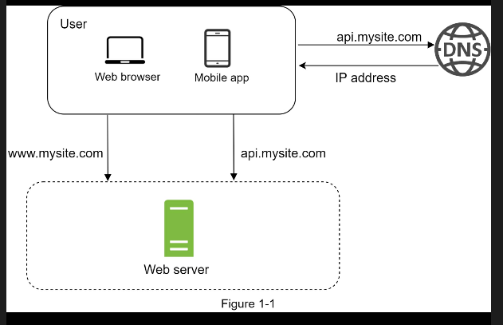
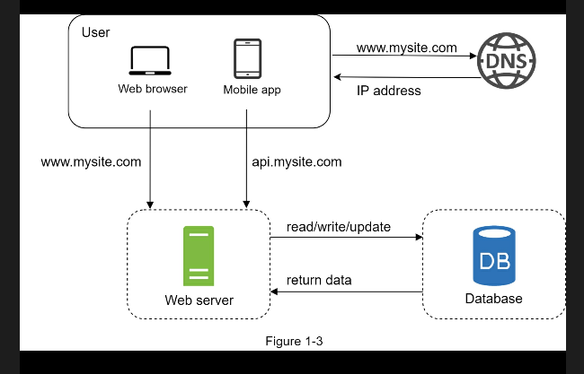
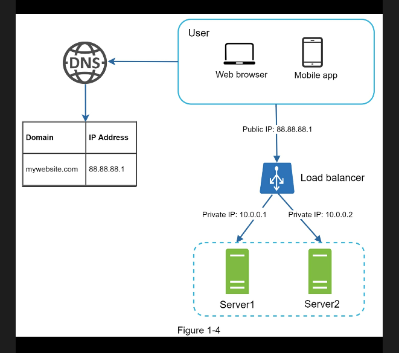
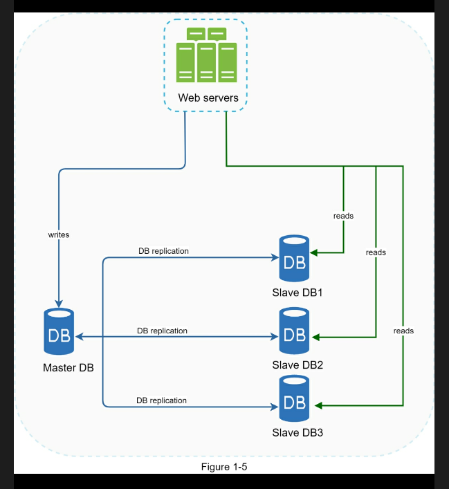
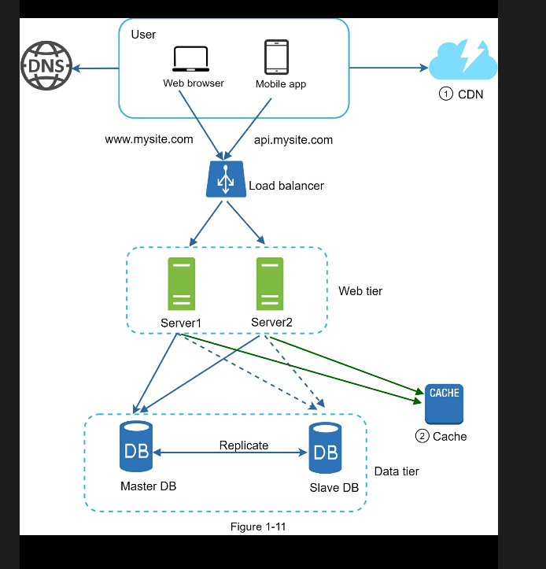

# Chapter 1: Scale From Zero to Millions of Users

>Designing a system that supports millions of users is challenging, and it is a journey that requires continuous refinement and endless improvement.

## Single server setup

To start with something simple, everything is running on a single server.

## Database

Separating web/mobile traffic (web tier) and database (data tier) servers allows them to be scaled independently.

You can choose between a traditional relational database and a non-relational database:
* Relational databases are also called a relational database management system (RDBMS) or SQL database. The most popular ones are MySQL, Oracle database, PostgreSQL, etc. Relational databases represent and store data in tables and rows. You can perform join operations using SQL across different database tables.
* Non-Relational databases are also called NoSQL databases. Popular ones are CouchDB, Neo4j, Cassandra, HBase, Amazon DynamoDB, etc.. These databases are grouped into four categories: key-value stores, graph stores, column stores, and document

For most developers, relational databases are the best option because they have been around for over 40 years and historically, they have worked well.

However, non-relational databases might be the right choice if:
* Your application requires super-low latency.
* Your data are unstructured, or you do not have any relational data.
* You only need to serialize and deserialize data (JSON, XML, YAML, etc.).
* You need to store a massive amount of data.

## Vertical scaling vs horizontal scaling

Vertical scaling, referred to as "scale up", means the process of adding more power (CPU, RAM, etc.) to your servers. Horizontal scaling, referred to as "scale-out", allows you to scale by adding more servers into your pool of resources.

When traffic is low, vertical scaling is a great option, and the simplicity of vertical scaling is its main advantage. Unfortunately, it comes with serious limitations:
* Vertical scaling has a hard limit. It is impossible to add unlimited CPU and memory to a single server.
* Vertical scaling does not have failover and redundancy. If one server goes down, the website/app goes down with it completely.

Horizontal scaling is more desirable for large scale applications due to the limitations of vertical scaling.

## Load balancer

A load balancer evenly distributes incoming traffic among web servers that are defined in a load-balanced set.

Users connect to the public IP of the load balancer directly. With this setup, web servers are unreachable directly by clients anymore. For better security, private IPs are used for communication between servers.

## Database replication

Quoted from Wikipedia:
>Database replication can be used in many database management systems, usually with a master/slave relationship between the original (master) and the copies (slaves).

A master database generally only supports write operations. A slave database gets copies of the data from the master database and only supports read operations. All the data-modifying commands like insert, delete, or update must be sent to the master database. Most applications require a much higher ratio of reads to writes; thus, the number of slave databases in a system is usually larger than the number of master databases.

Advantages of database replication:
* Better performance: In the master-slave model, all writes and updates happen in master nodes; whereas, read operations are distributed across slave nodes. This model improves performance because it allows more queries to be processed in parallel.
* Reliability: If one of your database servers is destroyed by a natural disaster, such as a typhoon or an earthquake, data is still preserved. You do not need to worry about data loss because data is replicated across multiple locations.
* High availability: By replicating data across different locations, your website remains in operation even if a database is offline as you can access data stored in another database server.

If only one slave database is available and it goes offline, read operations will be directed to the master database temporarily. As soon as the issue is found, a new slave database will replace the old one. In case multiple slave databases are available, read operations are redirected to other healthy slave databases. A new database server will replace the old one. If the master database goes offline, a slave database will be promoted to be the new master.

## Cache

A cache is a temporary storage area that stores the result of expensive responses or frequently accessed data in memory so that subsequent requests are served more quickly.

The cache tier is a temporary data store layer, much faster than the database. The benefits of having a separate cache tier include better system performance, ability to reduce database workloads, and the ability to scale the cache tier independently.

After receiving a request, a web server first checks if the cache has the available response. If it has, it sends data back to the client. If not, it queries the database, stores the response in cache, and sends it back to the client. This caching strategy is called a *read-through cache*.

Here are a few considerations for using a cache system:
* **Decide when to use cache**: Consider using cache when data is read frequently but modified infrequently. Since cached data is stored in volatile memory, a cache server is not ideal for persisting data. For instance, if a cache server restarts, all the data in memory is lost. Thus, important data should be saved in persistent data stores.
* **Expiration policy**: It is a good practice to implement an expiration policy. Once cached data is expired, it is removed from the cache. When there is no expiration policy, cached data will be stored in the memory permanently. It is advisable not to make the expiration date too short as this will cause the system to reload data from the database too frequently. Meanwhile, it is advisable not to make the expiration date too long as the data can become stale.
* **Consistency**: This involves keeping the data store and the cache in sync. Inconsistency can happen because data-modifying operations on the data store and cache are not in a single transaction. When scaling across multiple regions, maintaining consistency between the data store and cache is challenging. For further details, refer to the paper titled "Scaling Memcache at Facebook" published by Facebook.
* **Mitigating failures**: A single cache server represents a potential single point of failure (SPOF), defined in Wikipedia as follows: "A single point of failure (SPOF) is a part of a system that, if it fails, will stop the entire system from working". As a result, multiple cache servers across different data centers are recommended to avoid SPOF. Another recommended approach is to overprovision the required memory by
* **Eviction Policy**: Once the cache is full, any requests to add items to the cache might cause existing items to be removed. This is called cache eviction. Least-recently-used (LRU) is the most popular cache eviction policy. Other eviction policies, such as the Least Frequently Used (LFU) or First in First Out (FIFO), can be adopted to satisfy different use cases.

## Content delivery network (CDN)

A CDN is a network of geographically dispersed servers used to deliver static content. CDN servers cache static content like images, videos, CSS, JavaScript files, etc.

## Stateless web tier

